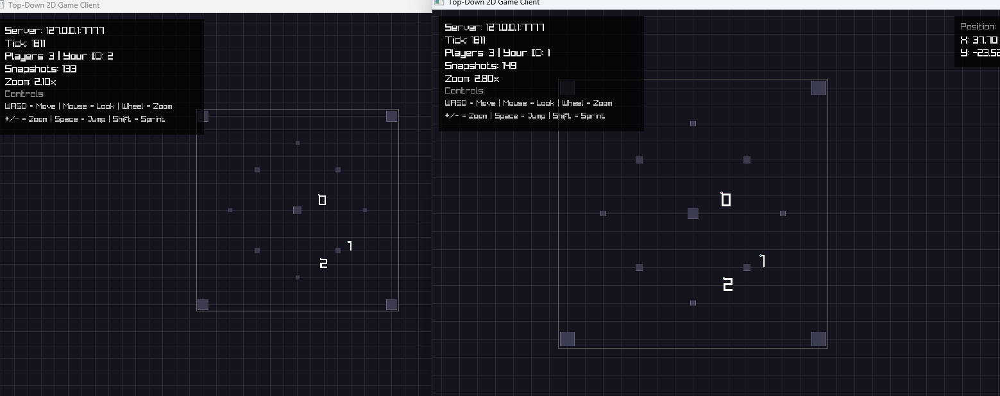

# RT-GameServer-ECS-FPS-Arena

Topdown multiplayer oyun projesi - ECS (Entity-Component-System) mimarisi ile geliştirilmiş, LDtk map yükleme ve SFML rendering desteği olan oyun sunucusu ve istemci uygulaması.

## 🎮 Proje Özellikleri

### ✅ Tamamlanan Özellikler

- **ECS Mimarisi**: Entity-Component-System pattern ile modüler oyun mantığı
  - Component-based entity yönetimi
  - System-based game logic
  - Type-safe component storage (SparseSet)
  
- **Multiplayer Server**: Authoritative game server
  - UDP network protokolü
  - Client connection management
  - Entity spawning ve snapshot sistemi
  - Fixed timestep game loop (60 TPS)

- **Client Integration**: LDtk-SFML oyun entegrasyonu
  - Server'a bağlanma ve otomatik entity senkronizasyonu
  - Remote player rendering
  - Local player movement (WASD + Ok tuşları)

- **LDtk Map System**: Level Designer Toolkit entegrasyonu
  - Tile layer rendering
  - Entity layer loading
  - Hot reload (F5)

- **SFML Rendering**: 2D grafik sistemi
  - VertexArray ile performanslı tile rendering
  - Sprite component sistemi
  - Camera following

## 🏗️ Proje Yapısı

```
RT-GameServer-ECS-FPS-Arena/
├── src/
│   ├── core/                    # ECS Core Framework
│   │   ├── Entity.hpp           # Entity ID ve generation sistemi
│   │   ├── Component.hpp         # Component type traits
│   │   ├── ComponentStorage.hpp # SparseSet-based storage
│   │   ├── ComponentRegistry.hpp# Component type registry
│   │   ├── System.hpp           # System base class
│   │   ├── SystemManager.hpp    # System lifecycle yönetimi
│   │   ├── World.hpp/cpp        # ECS World (merkezi yönetim)
│   │   ├── components/          # Game components
│   │   │   ├── PositionComponent.hpp
│   │   │   ├── VelocityComponent.hpp
│   │   │   └── SpriteComponent.hpp
│   │   └── systems/             # Game systems
│   │       └── MovementSystem.hpp
│   ├── server/                  # Game Server
│   │   ├── GameServer.hpp/cpp   # Ana server logic
│   │   ├── ServerNetworkManager.hpp/cpp  # UDP network yönetimi
│   │   ├── ServerConfig.hpp     # Server konfigürasyonu
│   │   └── main.cpp             # Server entry point
│   ├── client/                  # Game Client
│   │   ├── ClientNetworkManager.hpp/cpp  # Client network yönetimi
│   │   └── main.cpp             # Test client
│   ├── network/                 # Network Utilities
│   │   ├── Address.hpp          # IP/Port wrapper
│   │   ├── Packet.hpp           # Binary serialization
│   │   └── PacketTypes.hpp      # Packet type enum
│   ├── main.cpp                 # LDtkSFMLGame (ana oyun)
│   ├── TileMap.hpp/cpp          # LDtk map rendering
│   └── test_ecs.cpp             # ECS test executable
├── include/
│   └── common/
│       └── types.hpp             # Common type definitions
├── CMakeLists.txt               # Build configuration
└── README.md                    # Bu dosya
```

## 📋 Gereksinimler

### Sistem Gereksinimleri
- **İşletim Sistemi**: Windows 11 (PowerShell)
- **C++ Derleyici**: MSVC (Visual Studio 2019+)
- **CMake**: 3.15+

### Bağımlılıklar
- **[SFML](https://github.com/SFML/SFML)** 2.6.0: Grafik ve network kütüphanesi
  - `sfml-graphics`
  - `sfml-network`
  - `sfml-system`
  - `sfml-window`
  
- **[LDtkLoader](https://github.com/Madour/LDtkLoader)**: LDtk dosya yükleme
  - CMake tarafından otomatik olarak FetchContent ile indirilir

## 🔨 Build Talimatları

### 1. Projeyi Klonlayın
```powershell
git clone <repository-url>
cd RT-GameServer-ECS-FPS-Arena
```

### 2. Build Dizini Oluşturun
```powershell
mkdir build
cd build
```

### 3. CMake Yapılandırması
```powershell
cmake ..
```

### 4. Projeyi Derleyin
```powershell
# Tüm projeleri derle
cmake --build . --config Release

# Veya spesifik hedef
cmake --build . --config Release --target gameserver
cmake --build . --config Release --target LDtkSFMLGame
cmake --build . --config Release --target testclient
```

### 5. Çalıştırma
```powershell
# Server'ı başlat
.\Release\gameserver.exe

# Client'ı başlat (ayrı terminal)
.\Release\LDtkSFMLGame.exe
```

## 🎮 Kullanım

### Ekran Görüntüleri



*İki client'ın aynı anda bağlı olduğu multiplayer oyun görünümü - Yeni map.ldtk entegrasyonu ile collision detection aktif*

### Server Başlatma
```powershell
cd build\Release
.\gameserver.exe
```

Server varsayılan olarak `127.0.0.1:7777` adresinde dinler. Log çıktısı:
```
[INFO] Server başlatılıyor...
[INFO] Network manager başlatıldı
[INFO] Server 127.0.0.1:7777 adresinde dinliyor
[INFO] Client bağlandı: 127.0.0.1:XXXXX
[INFO] Player entity oluşturuldu: EntityID=1
```

### Client Bağlantısı
`LDtkSFMLGame.exe` çalıştırıldığında otomatik olarak server'a bağlanır ve oyuncu karakteri server'da spawn edilir.

**Kontroller:**
- **WASD** veya **Ok Tuşları**: Karakter hareketi
- **F5**: LDtk world reload

### Multiplayer Test
`test_multiplayer.ps1` script'i ile birden fazla client test edebilirsiniz:
```powershell
.\test_multiplayer.ps1
```

Bu script:
1. Server'ı başlatır
2. 2 saniye bekler
3. İlk client'ı başlatır
4. 2 saniye bekler
5. İkinci client'ı başlatır

## 🏛️ Mimari Detaylar

### ECS (Entity-Component-System)

**Entity**: Sadece ID ve generation içeren hafif yapı
```cpp
struct Entity {
    EntityID id;
    uint32_t generation;
};
```

**Component**: Veri yapıları (Position, Velocity, Sprite)
```cpp
struct PositionComponent {
    sf::Vector2f position;
};
```

**System**: Game logic (MovementSystem, RenderSystem)
```cpp
class MovementSystem : public System {
    void update(float deltaTime) override;
};
```

**World**: Merkezi ECS yönetimi
```cpp
World world;
auto entity = world.createEntity();
world.addComponent<PositionComponent>(entity, {100, 200});
```

### Network Protokolü

**Packet Types:**
- `CONNECT`: Client server'a bağlanma isteği
- `CONNECT_ACK`: Server bağlantı onayı
- `SNAPSHOT`: Server'dan client'a game state
- `DISCONNECT`: Bağlantı kopma

**Snapshot Sistemi:**
- Server her tick'te (60 TPS) game state'i serialize eder
- Client snapshot'ları alır ve remote entity'leri render eder
- Client prediction henüz implement edilmedi (gelecek özellik)

### Server Authority

Server tüm game state'i kontrol eder:
- Entity spawning
- Position updates
- Collision detection (gelecek özellik)

Client sadece:
- Input gönderir (gelecek özellik)
- Snapshot'ları alır ve render eder

## 🚧 Geliştirme Durumu

### MVP (Minimum Viable Product) - Devam Ediyor
- [x] ECS Core framework
- [x] Basic server-client connection
- [x] Entity spawning
- [x] Snapshot system
- [x] LDtk integration
- [ ] Input handling (client → server)
- [ ] Collision system
- [ ] Player movement synchronization
- [ ] Lag compensation

### Gelecek Özellikler
- [ ] Client prediction
- [ ] Interpolation
- [ ] Entity replication
- [ ] Game mechanics (shooting, health, etc.)
- [ ] Map collision integration
- [ ] Performance optimization

## 🐛 Bilinen Sorunlar

- Client'ta karakter görünürlüğü sorunları (düzeltme aşamasında)
- Input handling henüz implement edilmedi
- Collision detection server-side yok
- Lag compensation yok

## 📝 Notlar

- Proje C++17 standardı kullanıyor
- SFML DLL'leri otomatik olarak build dizinine kopyalanır
- Server ve client aynı network protokolünü kullanır
- LDtk map dosyaları `assets/` dizininde olmalı

## 📄 Lisans

Bu proje özgürce kullanılabilir. Orijinal LDtk-SFML-Game projesinden türetilmiştir.

## 🤝 Katkıda Bulunma

1. Fork yapın
2. Feature branch oluşturun (`git checkout -b feature/amazing-feature`)
3. Commit yapın (`git commit -m 'Add amazing feature'`)
4. Push yapın (`git push origin feature/amazing-feature`)
5. Pull Request açın

---

**Geliştirici Notu**: Bu proje aktif geliştirme aşamasındadır. MVP tamamlanana kadar API değişiklikleri olabilir.
