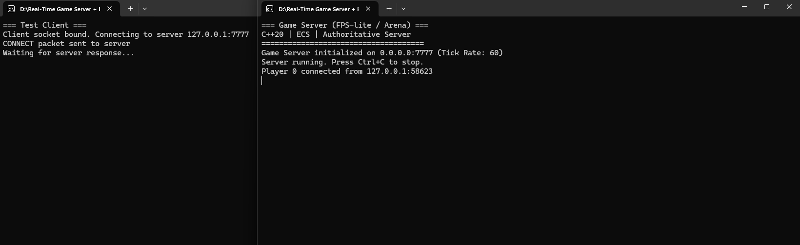

# Real-Time Game Server + ECS (FPS-lite Arena)

C++17 ile geliştirilmiş, ECS (Entity Component System) mimarisine sahip, yetkili (authoritative) gerçek zamanlı oyun sunucusu. FPS tarzı veya arena tipi oyunlar için temel altyapı sağlar.



*Sunucu ve test istemcisi bağlantı örneği*

## 🎮 Özellikler

- ✅ **ECS (Entity-Component-System)** mimarisi - Esnek ve ölçeklenebilir oyun mantığı
- ✅ **Network katmanı** - UDP socket abstraction (Windows/Linux)
- ✅ **Oda tabanlı** (room-based) sunucu - Çoklu oyun odası desteği
- ✅ **60/120 tick** server loop - Yüksek performanslı gerçek zamanlı simülasyon
- ✅ **Physics** katmanı - BVH spatial partitioning ile collision detection
- ✅ **Matchmaker** - Rating-based oyun eşleştirme sistemi
- ✅ **Anti-cheat-lite** - Temel hile önleme kontrolleri
- ✅ **Snapshot** yönetimi - Delta compression için hazır altyapı
- ✅ **Test Client** - Sunucu bağlantısını test etmek için basit istemci
- ⏳ Lag compensation (TODO)
- ⏳ Rollback/rewind (TODO)
- ⏳ Deterministik simülasyon (TODO)

## 📁 Proje Yapısı

```
Real-Time Game Server + ECS (FPS-lite  Arena)/
├── include/
│   └── common/
│       └── types.hpp          # Temel type tanımları
├── ecs/
│   ├── Entity.hpp             # Entity sınıfı
│   ├── Component.hpp/cpp      # Component base ve registry
│   ├── System.hpp             # System base (template)
│   └── World.hpp/cpp          # ECS World
├── net/
│   ├── Socket.hpp/cpp         # UDP socket wrapper
│   ├── Packet.hpp             # Packet reader/writer
│   └── Snapshot.hpp/cpp       # Snapshot ve delta compression
├── physics/
│   └── Physics.hpp/cpp        # Vec3, AABB, BVH
├── matchmaker/
│   └── Matchmaker.hpp/cpp     # Oyun eşleştirme
├── anti-cheat-lite/
│   └── AntiCheat.hpp/cpp      # Temel anti-cheat kontrolleri
├── src/
│   ├── Server.hpp/cpp         # Ana sunucu sınıfı
│   ├── main.cpp               # Server entry point
│   └── TestClient.cpp         # Test istemcisi
├── build.bat                  # Sunucu derleme script'i
├── build-client.bat           # İstemci derleme script'i
└── README.md
```

## 🛠️ Kurulum ve Derleme

### Gereksinimler

- **Windows 10/11**
- **MinGW** (Minimalist GNU for Windows) - `D:\MinGW\bin` dizininde kurulu olmalı
- **C++17** destekleyen derleyici (g++ 7.0+)

### MinGW Kurulumu

MinGW'nin `D:\MinGW` dizinine kurulu olduğundan emin olun. Eğer farklı bir dizine kuruluysa, `build.bat` ve `build-client.bat` dosyalarındaki `MINGW_PATH` değişkenini güncelleyin.

### Sunucuyu Derleme

1. Proje dizinine gidin:
```bash
cd "D:\Real-Time Game Server + ECS (FPS-lite  Arena)"
```

2. Sunucuyu derlemek için `build.bat` dosyasını çalıştırın:
```bash
.\build.bat
```

Bu komut `GameServer.exe` yürütülebilir dosyasını oluşturur.

### İstemciyi Derleme

1. Proje dizinine gidin:
```bash
cd "D:\Real-Time Game Server + ECS (FPS-lite  Arena)"
```

2. İstemciyi derlemek için `build-client.bat` dosyasını çalıştırın:
```bash
.\build-client.bat
```

Bu komut `TestClient.exe` yürütülebilir dosyasını oluşturur.

## 🚀 Kullanım

### Sunucuyu Çalıştırma

Sunucuyu başlatmak için `GameServer.exe` dosyasını çalıştırın:

```bash
# Varsayılan: port 7777, 60 tick
GameServer.exe

# Özel port ve tick rate
GameServer.exe 7777 60
```

Sunucu başarıyla başlatıldığında şu çıktıyı göreceksiniz:
```
=== Game Server (FPS-lite / Arena) ===
C++17 | ECS | Authoritative Server
=====================================
Game Server initialized on 0.0.0.0:7777 (Tick Rate: 60)
Server running. Press Ctrl+C to stop.
```

### İstemciyi Çalıştırma

Sunucu çalışırken, **yeni bir terminal penceresi** açın ve istemciyi çalıştırın:

```bash
# Varsayılan: 127.0.0.1:7777
TestClient.exe

# Farklı bir sunucu adresi ve portu için
TestClient.exe 127.0.0.1 7777
```

İstemci şunları yapar:
1. Server'a `CONNECT` paketi gönderir
2. Server yanıtını bekler
3. Her 2 saniyede bir `HEARTBEAT` paketi gönderir
4. Server'dan gelen paketleri dinler

### Bağlantı Testi

Sunucu terminalinde şu mesajı görmelisiniz:
```
Player 0 connected from 127.0.0.1:XXXXX
```

Bu, istemcinin başarıyla bağlandığını gösterir.

## 🔧 Teknik Detaylar

### ECS Mimarisi

- **Entity**: ID + component mask
- **Component**: Type-safe component registry
- **System**: Template-based system with component filtering
- **World**: Entity/component/system yönetimi

### Network

- UDP socket abstraction (Windows/Linux uyumlu)
- Packet header: type, sequence, tick, playerID
- Snapshot history (64 snapshot)
- Delta compression altyapısı hazır (implementation TODO)

### Physics

- BVH (Bounding Volume Hierarchy) spatial partitioning
- AABB collision detection
- Vec3 matematik kütüphanesi

### Matchmaker

- Rating-based matching
- Configurable tolerance
- Team size support

### Anti-Cheat

- Packet rate limiting
- Movement speed validation
- Suspicious action tracking

## 📊 Geliştirme Durumu

**✅ Tamamlanan:**
- Temel mimari
- ECS framework
- Network katmanı
- Sunucu çerçevesi
- Physics temel yapısı
- Test istemcisi

**⏳ Devam Eden:**
- Snapshot serialization
- Delta compression implementation
- Lag compensation
- Rollback/rewind

**📋 Planlanan:**
- Deterministik simülasyon
- Lua/AngelScript scripting
- Glicko-2 rating sistemi
- Profiling tools

## ⚠️ Önemli Notlar

- **C++ Standardı**: Proje C++17 standardı kullanmaktadır (MinGW 13.2.0 ile C++20 uyumsuzluğu nedeniyle)
- **MinGW Versiyonu**: MinGW 13.2.0 ile test edilmiştir
- **Platform**: Şu anda Windows için optimize edilmiştir, Linux desteği planlanmaktadır
- **Production Kullanımı**: Bu proje aktif geliştirme aşamasındadır. Production kullanımı için ek testler ve optimizasyonlar gereklidir

## 📝 Lisans

Bu proje eğitim/öğrenme amaçlıdır.

## 🤝 Katkıda Bulunma

Katkılarınızı bekliyoruz! Lütfen pull request göndermeden önce:
1. Kodunuzun temiz ve okunabilir olduğundan emin olun
2. Mevcut kod stilini takip edin
3. Test istemcisi ile bağlantıyı test edin

## 📧 İletişim

Sorularınız veya önerileriniz için issue açabilirsiniz.
